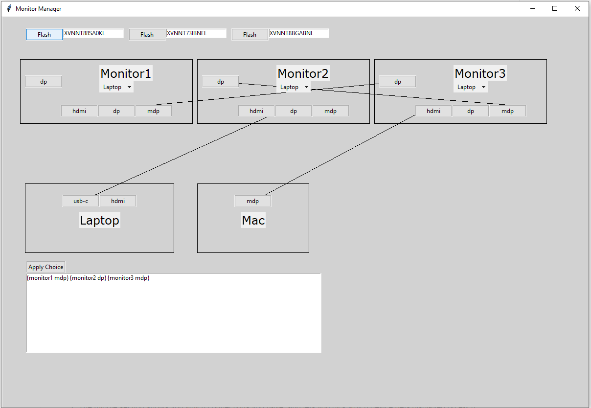

# Monitor-Setup-Helper
Do you stuggle to manager multiple monitors and multiple devices?
Well no longer!

This application let's you easily manage which devices get displayed on which monitors!

1) The top "Flash" panel lets you identify the serial number for each monitor so the program knows which monitor is which.
2) The middle section shows you which connections you have, and lets you pick which device gets displayed on each monitor.
3) Finally, the bottom section allows you to execute the change to display those devices.

# Installation:
	1) The user must install python3.
		https://www.python.org/downloads/
	2) The user must install easygui. [Outdated, they need tkinter]
		http://easygui.sourceforge.net/sourceforge_site_as_of_2014_11_21/download/version_0.96/index.html

# Assumptions:
	1) The user's monitors are setup as follows.
		[Monitor 1] - dp_out -> [Monitor 2] - dp_out -> ... -> [Monitor n (mst-off)]

# Definitions:
	0) daisy-chaining: The act of passing the output of one monitor into another to display one device on multiple monitors.
	1) monitor = monitor_index: Refers to the enumerated index of the monitor. *
	2) monitor_inputs: The input_port of the monitor.
	3) input_source = monitor_input_source: The monitor setting which selects which monitor_input to display.
	4) monitor_output: The monitor_input being displayed on a given monitor. **
	5) monitor_devices = monitor_displayed_devices: The actual device being displayed on the monitor. **

	* Note that there is the programatic [0, n] and user-friendly [1, n-1].
	** Note that due to daisy-chaining this is not just the input_source.

# Limitations:
	0) The Dell Display Manager (DDM.exe) can only affect monitors that are displaying
		the device executing it. Eg: If display2 is showing a mac, and display1 is showing a windows pc,
		the windows pc would be unable to automatically affect the mac display (display2).

	   Futhermore, this software is (unfortunely) unable for macOS).
	1) Doesn't handle asking for nothing to be displayed on a monitor.
	2) Devices are not limited to the number of monitors they can output to, or daisy-chain to.
		This would only be an issue for older devices connecting to more than 3 monitors.

# Improvements:
	1) If Dell Display Manager (ddm.exe) is installed, automatically change the configuration.
	2) Could use ddm.exe to automatically generate display configurations (number of monitors, ports, ...)
	3) The ability to daisy-chain is embeded in UsersStuff.devices, where as it should be the actual port of the device.
	4) Add unit tests
	5) Improve documentation & user guide
	6) Add gui for changing UsersStuff (and save to file)
	7) Create setup.py

