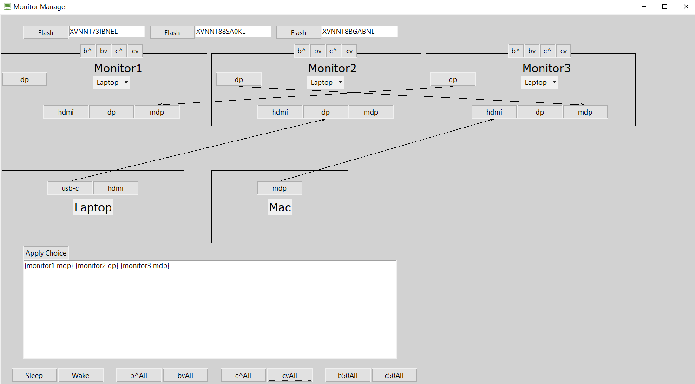

# Triple M
Do you struggle to manage multiple monitors connected to multiple devices?
Well no longer!

This application lets you easily manage which devices get displayed on which monitors!

In the above picture, you see the three serial numbers of my monitors that the program uses to automatically change their settings. Beneath that you see all my device connections. You can also see that I'm requesting that each monitor displays my laptop, and in the bottom it displays the input sources that my monitors need to be set to make this happen. If I click Apply Choice, the Dell Display Manager will automatically change the sources for me. Now if I want Monitor3 to display my mac, it only takes 3 clicks!

The gui can be broken down into three sections:

	1) The top "Flash" panel lets you identify the serial number for
		each monitor so the program can associate the programmed monitor with the physical one .

	2) The middle section uses arrows to show which ports are connected.
		 It also lets you pick which device gets displayed on each monitor.
		 Additionally, the brightness and contrast for each monitor can be updated.

	3) Finally, the bottom section allows you to execute the change to display those
		devices (assuming you have dell monitors compatible with the Dell Display Manager,
		otherwise this still provides you with the inputs that you can manually set).
		Additionally, the brightness and contrast for all monitors can be updated.
		The monitor's displays may also be turned off/on (tapping physical monitor buttons will turn them back on)

Here is a UML diagram for the daisy chaining algorithm I developed to figure out what a monitor displays (which was a big part of this!):

# Installation & Usage:
	1) The user must install python3.
		https://www.python.org/downloads/
	2) The gui either by running "Monitor Switcher.bat" or "src/gui.pyw".
	3) Right now, the user has to be comfortable with manipulating the .json files
		to change their setup. In the folder "json" there are 3 files:

		a) cables.json
			> You can add or remove cables that exist / you have by adding/removing:
				[
					"portA",
	            			"portB"
	        		],
		b) connections.json
			> You can add or remove connections by adding/removing:
				[
			        	"deviceA",
			        	"output_port_of_deviceA",
			        	"deviceB",
			        	"input_port_of_deviceB"
			    	],
		   where deviceB is generally a monitor.

		c) devices.json
			> You can add or remove devices by adding/removing:
				"deviceName": {
			        	"name": "deviceName",
			        	"inputs": [],
			        	"outputs": [
			            		"mdp"
			        	]
			    	},
			> You can add or remove monitors by adding/removing:
			    "monitor1": {
			        "name": "monitor1",
			        "serial": null,
			        "inputs": [
			             "hdmi",
			             "dp"
			        ],
			        "outputs": [
			            "dp"
			        ],
			        "watching": "mdp"
			    },
			Note:
				i) Serial numbers can start as null, but even if you have dell monitors,
					the program that can automatically change the displays for you wont
					be able to affect them. To determine the serial number, run the gui
					with the serial as null, the click the flash at the top of the gui.
					The monitor with that serial number will flash, then just copy and
					replace the null placeholder in the json file.

					This might seem tedious, but there is no other way for the computer to
					know which monitors your hand-picked names correspond to.
				ii) Its probably easiest just to copy-paste and modify the existing json files.

# Assumptions:
	1) The user's monitors are setup as follows.
		[Monitor 1] - dp_out -> [Monitor 2] - dp_out -> ... -> [Monitor n (mst-off)]
	2) Since a monitor can daisy chain dp and mdp inputs, and since chains can pass through
		a monitor that has its input source set to a non-daisy-chain capable source, there
		is an ambiguity as to which of those two sources gets passed through. I assume DP has
		priority over mdp.

# Limitations:
	1) The Dell Display Manager (DDM.exe) can only affect monitors that are displaying
		the device executing it. Eg: If display2 is showing a mac, and display1 is showing a
		windows pc, the windows pc would be unable to automatically affect the mac display (display2).

	   Furthermore, this software is (unfortunately) unavailable for macOS AND only available for
	   dell monitors. It's possible that other monitors have a similar software that can be
	   added (easily) as an extension.
	2) Devices are unrealistically not limited to the number of monitors they can
		daisy-chain to.
	3) Testing has only taken place for my configuration since that is the only thing I can
	 	know for sure. I've also done some brief testing for 4 monitors to check the
	 	daisy-chaining algorithm. And there are probably biases from only having one setup
	 	(specifically, 1 monitor type) to work with.
	4) All devices need to have unique names. I haven't tested whether multiple inputs can
	 	have the same name, eg: hdmi hdmi or if they should be unique: hdmi1 hdmi2.

# Improvements:
	1) Could ddm.exe be used to automatically generate display configurations (number of
		monitors, ports, ...)? Then the user wouldn't have to.
	2) Add gui functionality for:
		> Changing Connections, Devices
	3) This is my second gui (apart from html-js stuff) so that code is not great...
		There may be python libraries that use a similar style.
	4) The user has to resize the window if they have too many devices. But the bg color
		doesn't fill on resize.

